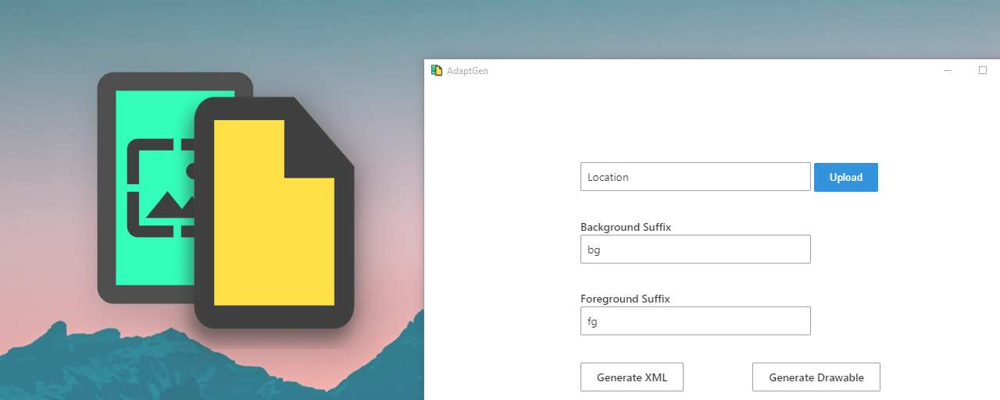

# AdaptGen

AdaptGen is an app used to generate XML and Drawable files for adaptive icon.

[Download](https://github.com/allstargaurav/AdaptGen/releases) | [Donate](https://www.paypal.com/paypalme/allstargaurav)

## How to use it

- Use the upload button to select all the images.
- Change the background and foreground suffix accordingly
- Click on generate button and select location where files will be generated

## Note

- Make sure icon name is something like iconname_bg.png, iconname_fg.png (includes suffix)
- When generating drawable, select an empty folder cuz it will generate multiple files depending on no of icons selected

## License

[MIT](https://github.com/allstargaurav/AdaptGen/blob/main/LICENSE)
